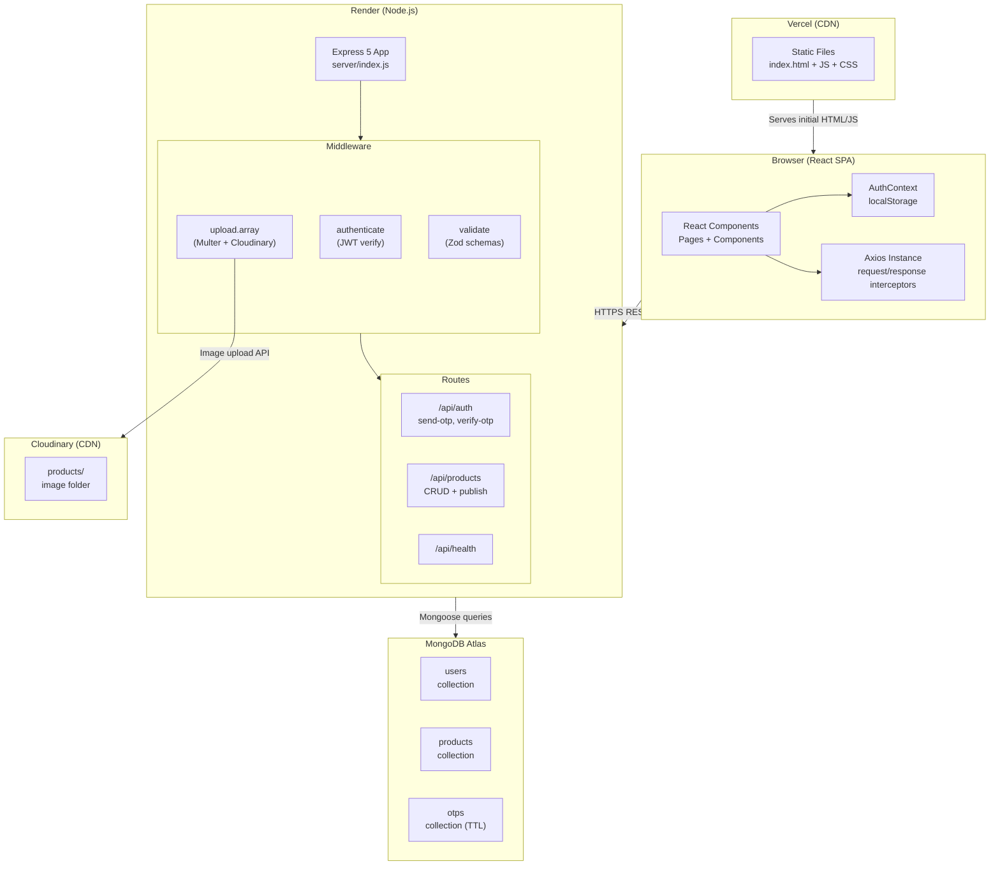
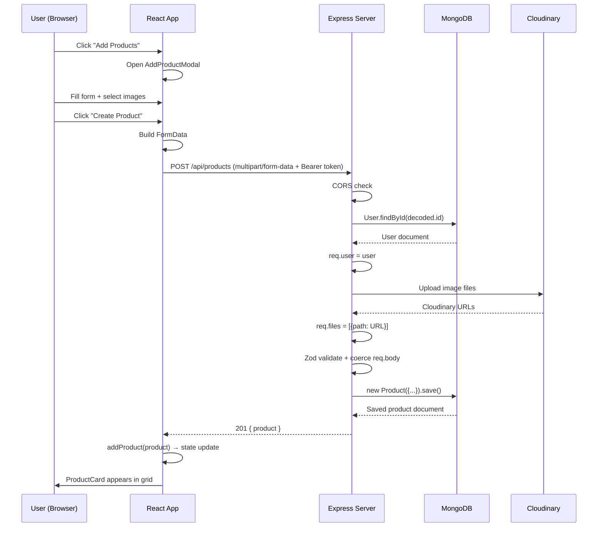
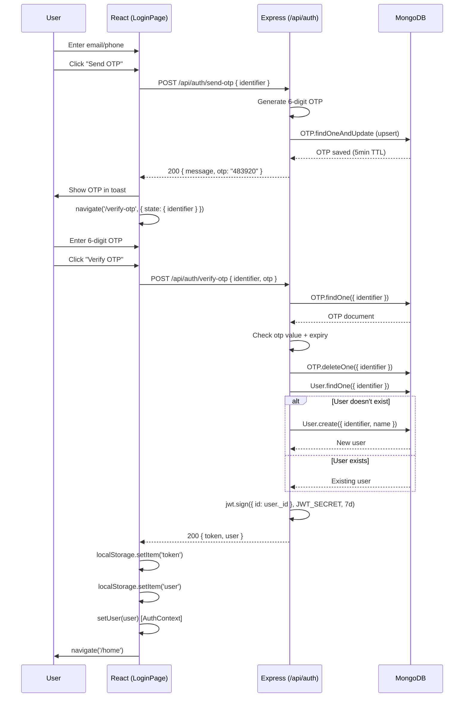
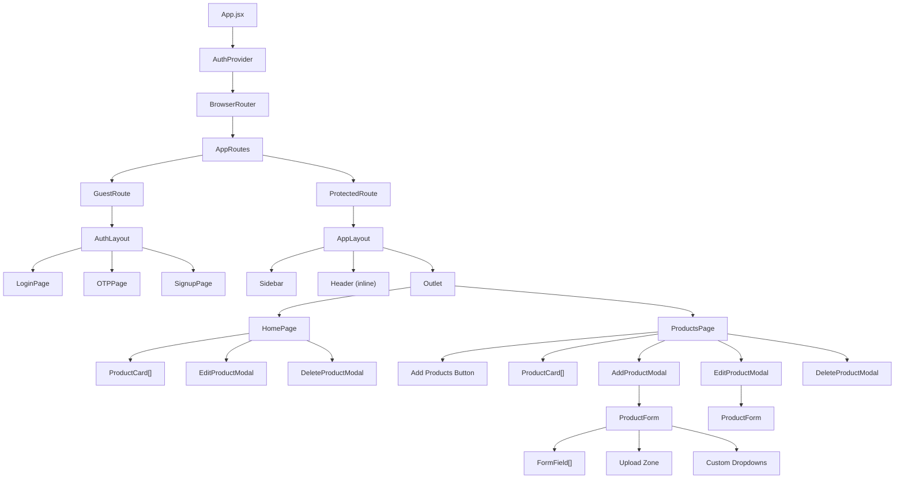

# Architecture Diagram

## System Architecture

```mermaid
graph TB
    subgraph Browser["Browser (React SPA)"]
        UI["React Components\nPages + Components"]
        CTX["AuthContext\nlocalStorage"]
        AX["Axios Instance\nrequest/response interceptors"]
        UI --> CTX
        UI --> AX
    end

    subgraph Vercel["Vercel (CDN)"]
        STATIC["Static Files\nindex.html + JS + CSS"]
    end

    subgraph Render["Render (Node.js)"]
        EXP["Express 5 App\nserver/index.js"]
        
        subgraph MW["Middleware"]
            AUTH["authenticate\n(JWT verify)"]
            UPLOAD["upload.array\n(Multer + Cloudinary)"]
            VALID["validate\n(Zod schemas)"]
        end
        
        subgraph Routes["Routes"]
            RAUTH["/api/auth\n send-otp, verify-otp"]
            RPROD["/api/products\n CRUD + publish"]
            RHEALTH["/api/health"]
        end
        
        EXP --> MW
        MW --> Routes
    end

    subgraph Atlas["MongoDB Atlas"]
        USERS["users\ncollection"]
        PRODUCTS["products\ncollection"]
        OTPS["otps\ncollection (TTL)"]
    end

    subgraph Cloud["Cloudinary (CDN)"]
        IMGS["products/\nimage folder"]
    end

    Browser -->|"HTTPS REST calls"| Render
    Render -->|"Mongoose queries"| Atlas
    UPLOAD -->|"Image upload API"| Cloud
    Vercel -->|"Serves initial HTML/JS"| Browser
```

---

## Request Flow Diagram

```mermaid
sequenceDiagram
    participant U as User (Browser)
    participant R as React App
    participant E as Express Server
    participant M as MongoDB
    participant C as Cloudinary

    U->>R: Click "Add Products"
    R->>R: Open AddProductModal
    U->>R: Fill form + select images
    U->>R: Click "Create Product"
    
    R->>R: Build FormData
    R->>E: POST /api/products (multipart/form-data + Bearer token)
    
    E->>E: CORS check
    E->>M: User.findById(decoded.id)
    M-->>E: User document
    E->>E: req.user = user
    
    E->>C: Upload image files
    C-->>E: Cloudinary URLs
    E->>E: req.files = [{path: URL}]
    
    E->>E: Zod validate + coerce req.body
    E->>M: new Product({...}).save()
    M-->>E: Saved product document
    
    E-->>R: 201 { product }
    R->>R: addProduct(product) → state update
    R->>U: ProductCard appears in grid
```

---

## Authentication Flow Diagram

```mermaid
sequenceDiagram
    participant U as User
    participant R as React (LoginPage)
    participant E as Express (/api/auth)
    participant M as MongoDB

    U->>R: Enter email/phone
    U->>R: Click "Send OTP"
    
    R->>E: POST /api/auth/send-otp { identifier }
    E->>E: Generate 6-digit OTP
    E->>M: OTP.findOneAndUpdate (upsert)
    M-->>E: OTP saved (5min TTL)
    E-->>R: 200 { message, otp: "483920" }
    
    R->>U: Show OTP in toast
    R->>R: navigate('/verify-otp', { state: { identifier } })
    
    U->>R: Enter 6-digit OTP
    U->>R: Click "Verify OTP"
    
    R->>E: POST /api/auth/verify-otp { identifier, otp }
    E->>M: OTP.findOne({ identifier })
    M-->>E: OTP document
    E->>E: Check otp value + expiry
    E->>M: OTP.deleteOne({ identifier })
    E->>M: User.findOne({ identifier })
    
    alt User doesn't exist
        E->>M: User.create({ identifier, name })
        M-->>E: New user
    else User exists
        M-->>E: Existing user
    end
    
    E->>E: jwt.sign({ id: user._id }, JWT_SECRET, 7d)
    E-->>R: 200 { token, user }
    
    R->>R: localStorage.setItem('token')
    R->>R: localStorage.setItem('user')
    R->>R: setUser(user) [AuthContext]
    R->>U: navigate('/home')
```

---

## Component Hierarchy Diagram

```mermaid
graph TD
    APP["App.jsx"]
    PROV["AuthProvider"]
    BR["BrowserRouter"]
    ROUTES["AppRoutes"]
    
    APP --> PROV --> BR --> ROUTES
    
    ROUTES --> GUEST["GuestRoute"]
    ROUTES --> PROT["ProtectedRoute"]
    
    GUEST --> AL["AuthLayout"]
    AL --> LOGIN["LoginPage"]
    AL --> OTP["OTPPage"]
    AL --> SIGNUP["SignupPage"]
    
    PROT --> APPLAYOUT["AppLayout"]
    APPLAYOUT --> SIDEBAR["Sidebar"]
    APPLAYOUT --> HEADER["Header (inline)"]
    APPLAYOUT --> OUTLET["Outlet"]
    
    OUTLET --> HOME["HomePage"]
    OUTLET --> PRODUCTS["ProductsPage"]
    
    HOME --> CARD1["ProductCard[]"]
    HOME --> EDM1["EditProductModal"]
    HOME --> DDM1["DeleteProductModal"]
    
    PRODUCTS --> BTN["Add Products Button"]
    PRODUCTS --> CARD2["ProductCard[]"]
    PRODUCTS --> APM["AddProductModal"]
    PRODUCTS --> EDPM["EditProductModal"]
    PRODUCTS --> DDM2["DeleteProductModal"]
    
    APM --> PF1["ProductForm"]
    EDPM --> PF2["ProductForm"]
    
    PF1 --> FF["FormField[]"]
    PF1 --> UP["Upload Zone"]
    PF1 --> DD["Custom Dropdowns"]
```
