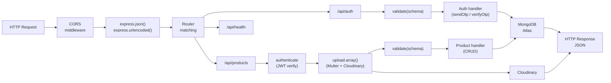
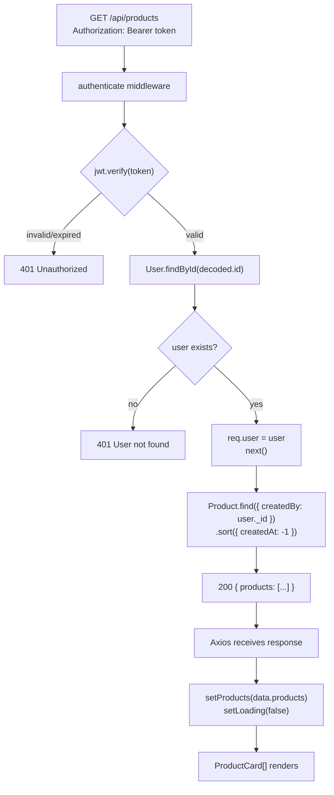
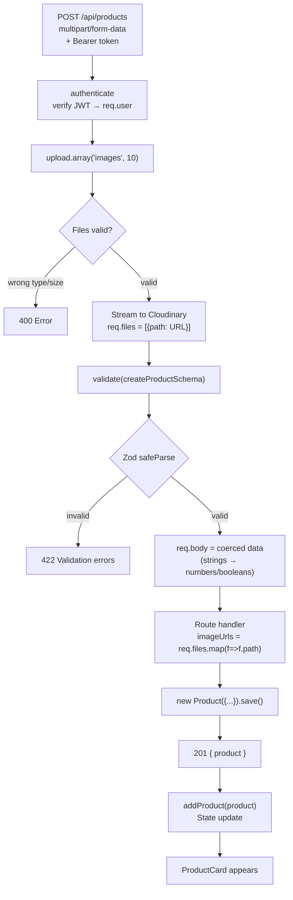
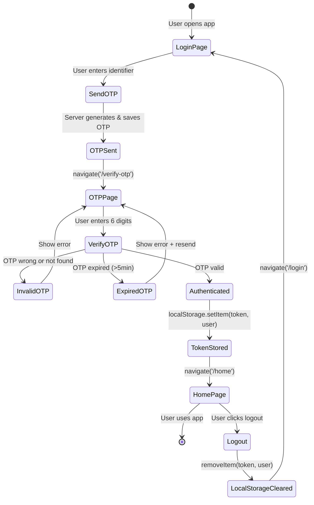
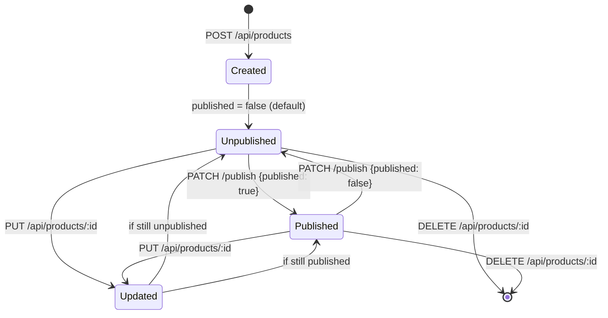

# Request Flow Diagrams

## Middleware Execution Chain

---

## GET /api/products — Data Flow

---

## POST /api/products — Data Flow

---

## OTP Authentication — State Machine

---

## Product State Transitions

