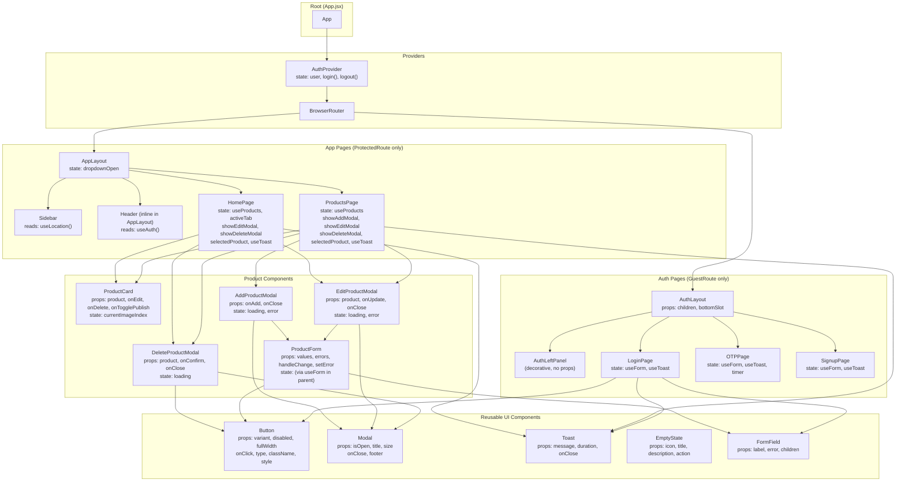

# Component Tree

## Full Component Hierarchy with Props and State



---

## Data Ownership Map

| Component | Owns State | Receives via Props |
|---|---|---|
| `AuthProvider` | `user`, `login`, `logout` | — |
| `ProductsPage` | `products`, `loading`, `showModals`, `selectedProduct` | — |
| `HomePage` | `products`, `loading`, `activeTab`, `showModals`, `selectedProduct` | — |
| `ProductCard` | `currentImageIndex` | `product`, `onEdit`, `onDelete`, `onTogglePublish` |
| `AddProductModal` | `loading`, `error` | `onAdd`, `onClose` |
| `EditProductModal` | `loading`, `error` | `product`, `onUpdate`, `onClose` |
| `DeleteProductModal` | `loading` | `product`, `onConfirm`, `onClose` |
| `ProductForm` | (all via useForm in parent) | `values`, `errors`, `handleChange`, `setError` |
| `AppLayout` | `dropdownOpen` | — |
| `Sidebar` | — | (reads `useLocation` internally) |

---

## Hook Dependency Map

```
useAuth()
  → reads AuthContext
  → used by: ProtectedRoute, GuestRoute, AppLayout header, Axios interceptor

useProducts()
  → calls productsApi.getAll()
  → returns: { products, loading, addProduct, updateProduct, removeProduct, togglePublish, deleteProduct }
  → used by: HomePage, ProductsPage

useForm(initialValues)
  → returns: { values, errors, handleChange, setError, reset, setValues }
  → used by: ProductForm, LoginPage, OTPPage, SignupPage

useToast()
  → returns: { toast, showToast, clearToast }
  → used by: HomePage, ProductsPage, LoginPage, OTPPage

useLocation() [React Router]
  → used by: Sidebar (active route highlighting)

useNavigate() [React Router]
  → used by: LoginPage, OTPPage, SignupPage, AppLayout (logout)

useSearchParams() [React Router]
  → used by: HomePage, ProductsPage (search query)
```
